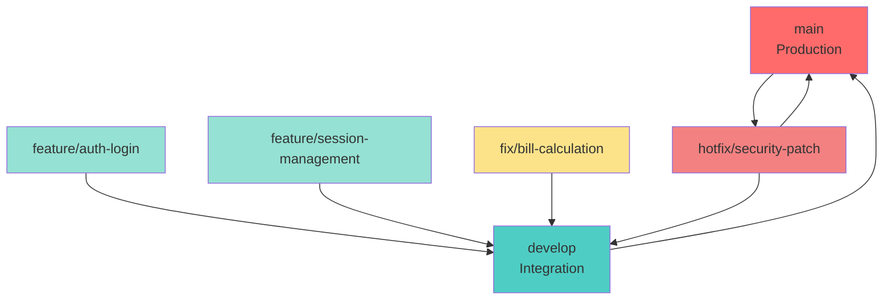

# PROJECT GUIDELINES & DEVELOPMENT RULES

> **Tài liệu này định nghĩa các quy tắc làm việc, coding conventions, và standards cho dự án SplitBuddy.**  
> Tất cả developers phải tuân thủ các quy tắc này để đảm bảo code quality và consistency trong team.

---

## 📋 Mục lục

1. [Coding Conventions](#1-coding-conventions)
   - [1.1 Backend (Rust)](#11-backend-rust)
   - [1.2 Frontend (React/TypeScript)](#12-frontend-reacttypescript)
2. [Git Workflow & Version Control](#2-git-workflow--version-control)
   - [2.1 Branching Strategy](#21-branching-strategy)
   - [2.2 Commit Message Convention](#22-commit-message-convention)
3. [API Standard & Communication Rules](#3-api-standard--communication-rules)
   - [3.1 Response Format](#31-response-format-envelope-pattern)
   - [3.2 HTTP Status Codes](#32-http-status-codes)
   - [3.3 Data Format Standards](#33-data-format-standards)
4. [Definition of Done (DoD)](#4-definition-of-done-dod)

---

## 1. Coding Conventions

### 1.1 Backend (Rust)

#### Naming Conventions

| Type | Convention | Example |
|------|-----------|---------|
| Variables | `snake_case` | `user_id`, `total_amount` |
| Functions | `snake_case` | `calculate_debt()`, `get_user_by_id()` |
| Structs | `PascalCase` | `User`, `Bill`, `SessionParticipant` |
| Enums | `PascalCase` | `SplitStrategy`, `SessionStatus` |
| Enum Variants | `PascalCase` | `SplitStrategy::Equal`, `SessionStatus::Active` |
| Constants | `SCREAMING_SNAKE_CASE` | `MAX_RETRY_COUNT`, `DEFAULT_PAGE_SIZE` |
| Modules | `snake_case` | `user_service`, `bill_repository` |
| Type Aliases | `PascalCase` | `UserId`, `Amount` |

**Ví dụ:**

```rust
// ✅ GOOD
const MAX_RETRY_COUNT: u32 = 3;
type UserId = Uuid;

struct Bill {
    id: Uuid,
    session_id: Uuid,
    amount: Decimal,
    description: String,
}

enum SplitStrategy {
    Equal,
    Custom,
    Weighted,
}

fn calculate_debt(session_id: Uuid) -> Result<Vec<Debt>, AppError> {
    // ...
}

// ❌ BAD
const maxRetryCount: u32 = 3;  // Should be SCREAMING_SNAKE_CASE
struct bill { }  // Should be PascalCase
fn CalculateDebt() { }  // Should be snake_case
```

#### Error Handling

**Nguyên tắc:**
- **Luôn sử dụng `Result<T, E>`** cho các operations có thể fail
- **Tuyệt đối không dùng `unwrap()`, `expect()`, `unwrap_or_default()`** trong production code
- Chỉ được dùng `unwrap()` trong tests hoặc khi chắc chắn 100% không thể fail
- Sử dụng custom Error enum với `thiserror` hoặc `anyhow` cho error propagation

**Error Enum Pattern:**

```rust
use thiserror::Error;

#[derive(Error, Debug)]
pub enum AppError {
    #[error("Database error: {0}")]
    Database(#[from] sqlx::Error),
    
    #[error("User not found: {user_id}")]
    UserNotFound { user_id: Uuid },
    
    #[error("Invalid bill amount: {amount}. Must be greater than 0")]
    InvalidBillAmount { amount: Decimal },
    
    #[error("Unauthorized: {message}")]
    Unauthorized { message: String },
    
    #[error("Validation error: {field} - {message}")]
    Validation { field: String, message: String },
}

// Usage
fn create_bill(bill: CreateBillDto) -> Result<Bill, AppError> {
    if bill.amount <= Decimal::ZERO {
        return Err(AppError::InvalidBillAmount { amount: bill.amount });
    }
    
    // Database operation
    let bill = sqlx::query_as::<_, Bill>(/* ... */)
        .fetch_one(&pool)
        .await?;  // ? operator converts sqlx::Error to AppError
    
    Ok(bill)
}
```

**Error Handling Best Practices:**

```rust
// ✅ GOOD: Proper error handling
match get_user_by_id(user_id).await {
    Ok(user) => Ok(user),
    Err(AppError::UserNotFound { .. }) => {
        // Handle specific error case
        Err(AppError::Unauthorized { 
            message: "User not found".to_string() 
        })
    }
    Err(e) => Err(e),  // Propagate other errors
}

// ✅ GOOD: Using ? operator for error propagation
async fn process_bill(bill_id: Uuid) -> Result<Bill, AppError> {
    let bill = get_bill(bill_id).await?;
    let debts = calculate_debt(bill.session_id).await?;
    update_debts(debts).await?;
    Ok(bill)
}

// ❌ BAD: Using unwrap() in production code
let user = get_user_by_id(user_id).await.unwrap();  // NEVER DO THIS

// ❌ BAD: Ignoring errors
let _ = create_bill(bill).await;  // Error is silently ignored
```

#### Code Quality Tools

**Clippy (Linter):**
- Bắt buộc chạy `cargo clippy -- -D warnings` trước khi commit
- Tất cả warnings phải được fix, không được ignore
- File `.clippy.toml` có thể được dùng để customize rules (nhưng phải được team approve)

```bash
# Run clippy with deny warnings
cargo clippy -- -D warnings

# Fix auto-fixable issues
cargo clippy --fix
```

**Rustfmt (Formatter):**
- Bắt buộc format code với `rustfmt` trước khi commit
- File `.rustfmt.toml` trong root để config formatting rules

```bash
# Format all code
cargo fmt

# Check formatting without changing files
cargo fmt --check
```

**Recommended `.rustfmt.toml`:**

```toml
edition = "2021"
max_width = 100
tab_spaces = 4
newline_style = "Unix"
use_small_heuristics = "Default"
```

#### Project Structure

Backend project structure theo Domain-Driven Design principles:

```
src/
├── api/              # HTTP handlers, routes, request/response DTOs
│   ├── auth.rs
│   ├── sessions.rs
│   ├── bills.rs
│   └── mod.rs
├── domain/           # Business logic, domain models
│   ├── user.rs
│   ├── session.rs
│   ├── bill.rs
│   ├── debt.rs
│   └── mod.rs
├── repository/       # Database access layer (SQLx queries)
│   ├── user_repository.rs
│   ├── session_repository.rs
│   ├── bill_repository.rs
│   └── mod.rs
├── infra/            # Infrastructure: DB connection, config, external services
│   ├── database.rs
│   ├── config.rs
│   └── mod.rs
├── utils/            # Shared utilities: JWT, errors, validators
│   ├── jwt.rs
│   ├── errors.rs
│   └── mod.rs
└── main.rs           # Application entry point
```

**Module Organization Example:**

```rust
// src/domain/bill.rs
use rust_decimal::Decimal;
use uuid::Uuid;

pub struct Bill {
    pub id: Uuid,
    pub session_id: Uuid,
    pub amount: Decimal,
    pub description: String,
    pub created_at: chrono::DateTime<chrono::Utc>,
}

pub enum SplitStrategy {
    Equal,
    Custom,
    Weighted,
}

// Business logic functions
impl Bill {
    pub fn validate(&self) -> Result<(), AppError> {
        if self.amount <= Decimal::ZERO {
            return Err(AppError::InvalidBillAmount { amount: self.amount });
        }
        Ok(())
    }
}

// src/repository/bill_repository.rs
use crate::domain::bill::Bill;

pub struct BillRepository {
    pool: PgPool,
}

impl BillRepository {
    pub async fn create(&self, bill: &Bill) -> Result<Bill, AppError> {
        // SQLx query implementation
    }
}

// src/api/bills.rs
use crate::domain::bill::Bill;
use crate::repository::bill_repository::BillRepository;

pub async fn create_bill_handler(
    State(repo): State<BillRepository>,
    Json(payload): Json<CreateBillDto>,
) -> Result<Json<BillResponse>, AppError> {
    // Handler implementation
}
```

#### Decimal Handling (Critical for Money)

**⚠️ CRITICAL RULE:** Tuyệt đối không dùng `f32`/`f64` cho tiền tệ!

```rust
// ✅ GOOD: Using rust_decimal
use rust_decimal::Decimal;

struct Bill {
    amount: Decimal,  // Always use Decimal for money
}

// Calculate with Decimal
let total: Decimal = bills.iter()
    .map(|b| b.amount)
    .sum();

// ❌ BAD: Using f64 for money
struct Bill {
    amount: f64,  // NEVER DO THIS - floating point errors!
}
```

---

### 1.2 Frontend (React/TypeScript)

#### Component Structure (Hybrid Approach)

**Cấu trúc thư mục:**

```
src/
├── components/           # Shared/reusable components
│   ├── ui/              # Base UI components (Button, Input, Card)
│   │   ├── Button.tsx
│   │   ├── Input.tsx
│   │   └── Card.tsx
│   ├── layout/          # Layout components
│   │   ├── Navbar.tsx
│   │   ├── Sidebar.tsx
│   │   └── Container.tsx
│   └── index.ts         # Re-exports
├── features/            # Feature-based modules
│   ├── auth/
│   │   ├── components/  # Feature-specific components
│   │   │   ├── LoginForm.tsx
│   │   │   └── RegisterForm.tsx
│   │   ├── hooks/       # Feature-specific hooks
│   │   │   ├── useAuth.ts
│   │   │   └── useLogin.ts
│   │   ├── api/         # API calls for this feature
│   │   │   └── authApi.ts
│   │   ├── types.ts     # TypeScript types for this feature
│   │   └── index.ts     # Public exports
│   ├── sessions/
│   │   ├── components/
│   │   ├── hooks/
│   │   ├── api/
│   │   └── types.ts
│   └── bills/
│       ├── components/
│       ├── hooks/
│       ├── api/
│       └── types.ts
├── hooks/               # Shared hooks (useDebounce, useLocalStorage)
├── utils/               # Utility functions
├── lib/                 # Third-party library configs (axios, queryClient)
├── types/               # Global TypeScript types
└── App.tsx
```

#### Naming Conventions

| Type | Convention | Example |
|------|-----------|---------|
| Components | `PascalCase.tsx` | `LoginForm.tsx`, `BillCard.tsx` |
| Hooks | `useCamelCase.ts` | `useAuth.ts`, `useSessionList.ts` |
| Utils | `camelCase.ts` | `formatCurrency.ts`, `validateEmail.ts` |
| Types/Interfaces | `PascalCase` | `User`, `Bill`, `SessionParticipant` |
| Constants | `SCREAMING_SNAKE_CASE` | `API_BASE_URL`, `MAX_FILE_SIZE` |
| Files/Folders | `camelCase` hoặc `kebab-case` | `authApi.ts` hoặc `auth-api.ts` |

**Ví dụ:**

```typescript
// ✅ GOOD: Component naming
// components/ui/Button.tsx
export const Button: React.FC<ButtonProps> = ({ children, onClick }) => {
  // ...
};

// ✅ GOOD: Hook naming
// features/auth/hooks/useAuth.ts
export const useAuth = () => {
  // ...
};

// ✅ GOOD: Type naming
// features/sessions/types.ts
export interface Session {
  id: string;
  name: string;
  status: SessionStatus;
}

// ❌ BAD
export const button = () => {};  // Should be PascalCase
export const UseAuth = () => {};  // Hooks should be camelCase with 'use' prefix
```

#### Component Structure Example

```typescript
// features/sessions/components/SessionCard.tsx
import React from 'react';
import { Card } from '@/components/ui/Card';
import { Session } from '../types';
import { useSessionActions } from '../hooks/useSessionActions';

interface SessionCardProps {
  session: Session;
  onSelect?: (sessionId: string) => void;
}

export const SessionCard: React.FC<SessionCardProps> = ({ 
  session, 
  onSelect 
}) => {
  const { deleteSession } = useSessionActions();
  
  const handleDelete = async () => {
    await deleteSession.mutateAsync(session.id);
  };
  
  return (
    <Card>
      <h3>{session.name}</h3>
      <p>Status: {session.status}</p>
      <button onClick={() => onSelect?.(session.id)}>View</button>
      <button onClick={handleDelete}>Delete</button>
    </Card>
  );
};
```

#### State Management Rules

**Khi nào dùng gì:**

| State Type | Tool | Use Case |
|-----------|------|----------|
| **UI State** | `useState` | Form inputs, modal open/close, dropdown state |
| **Form State** | `useState` hoặc `react-hook-form` | Form validation, field values |
| **Server State** | **TanStack Query** | API data, caching, refetching |
| **Global UI State** | **Context API** | Theme, sidebar open/close, notifications |
| **Complex Client State** | **Zustand** (nếu cần) | Shopping cart, multi-step forms |

**TanStack Query (React Query) - Primary cho Server State:**

```typescript
// ✅ GOOD: Using React Query for server state
// features/sessions/hooks/useSessions.ts
import { useQuery, useMutation, useQueryClient } from '@tanstack/react-query';
import { sessionsApi } from '../api/sessionsApi';

export const useSessions = () => {
  return useQuery({
    queryKey: ['sessions'],
    queryFn: sessionsApi.getAll,
    staleTime: 5 * 60 * 1000, // 5 minutes
  });
};

export const useCreateSession = () => {
  const queryClient = useQueryClient();
  
  return useMutation({
    mutationFn: sessionsApi.create,
    onSuccess: () => {
      // Invalidate and refetch
      queryClient.invalidateQueries({ queryKey: ['sessions'] });
    },
  });
};
```

**Local State với useState:**

```typescript
// ✅ GOOD: Using useState for UI state
const LoginForm: React.FC = () => {
  const [email, setEmail] = useState('');
  const [isLoading, setIsLoading] = useState(false);
  const [showPassword, setShowPassword] = useState(false);
  
  const { mutate: login } = useLogin(); // React Query mutation
  
  const handleSubmit = (e: React.FormEvent) => {
    e.preventDefault();
    setIsLoading(true);
    login({ email, password }, {
      onSettled: () => setIsLoading(false),
    });
  };
  
  return (
    <form onSubmit={handleSubmit}>
      <input 
        type="email" 
        value={email} 
        onChange={(e) => setEmail(e.target.value)} 
      />
      {/* ... */}
    </form>
  );
};
```

**Context API - Chỉ cho Global UI State:**

```typescript
// ✅ GOOD: Using Context for theme/global UI
// contexts/ThemeContext.tsx
const ThemeContext = createContext<ThemeContextType | undefined>(undefined);

export const ThemeProvider: React.FC<{ children: React.ReactNode }> = ({ 
  children 
}) => {
  const [theme, setTheme] = useState<'light' | 'dark'>('light');
  
  return (
    <ThemeContext.Provider value={{ theme, setTheme }}>
      {children}
    </ThemeContext.Provider>
  );
};

// ❌ BAD: Don't use Context for server state
// Use React Query instead!
```

#### TypeScript Best Practices

```typescript
// ✅ GOOD: Explicit types, no 'any'
interface CreateBillDto {
  description: string;
  totalAmount: string;  // Decimal as string from API
  sessionId: string;
  payers: PayerDto[];
}

// ✅ GOOD: Using type guards
function isSession(obj: unknown): obj is Session {
  return (
    typeof obj === 'object' &&
    obj !== null &&
    'id' in obj &&
    'name' in obj
  );
}

// ✅ GOOD: Proper error handling
const handleApiCall = async () => {
  try {
    const data = await api.getSessions();
    // ...
  } catch (error) {
    if (error instanceof Error) {
      console.error(error.message);
    }
  }
};

// ❌ BAD: Using 'any'
const data: any = await api.getSessions();  // NEVER use 'any'

// ❌ BAD: Ignoring TypeScript errors
// @ts-ignore
const result = someFunction();
```

---

## 2. Git Workflow & Version Control

### 2.1 Branching Strategy

Chúng ta sử dụng **Gitflow đơn giản hóa** với các branch chính:

#### Branch Types

| Branch | Purpose | Base Branch | Merge To |
|--------|---------|-------------|----------|
| `main` | Production-ready code | - | - |
| `develop` | Integration branch | - | `main` |
| `feature/*` | New features | `develop` | `develop` |
| `fix/*` | Bug fixes | `develop` | `develop` |
| `hotfix/*` | Urgent production fixes | `main` | `main` + `develop` |

#### Branch Naming Convention

```
feature/<module>-<description>
fix/<module>-<description>
hotfix/<description>
```

**Ví dụ:**
- `feature/auth-login`
- `feature/session-management`
- `feature/bill-custom-split`
- `fix/bill-calculation-error`
- `fix/debt-display-bug`
- `hotfix/critical-security-patch`

#### Git Workflow Diagram



#### Workflow Steps

**1. Starting a new feature:**
```bash
git checkout develop
git pull origin develop
git checkout -b feature/auth-login
# Work on feature...
git commit -m "feat(auth): implement login form"
git push origin feature/auth-login
# Create Pull Request to develop
```

**2. Starting a bug fix:**
```bash
git checkout develop
git pull origin develop
git checkout -b fix/bill-calculation-error
# Fix the bug...
git commit -m "fix(bill): correct decimal calculation"
git push origin fix/bill-calculation-error
# Create Pull Request to develop
```

**3. Hotfix (urgent production fix):**
```bash
git checkout main
git pull origin main
git checkout -b hotfix/critical-security-patch
# Fix the issue...
git commit -m "hotfix(security): patch XSS vulnerability"
git push origin hotfix/critical-security-patch
# Create Pull Request to main
# After merge to main, also merge to develop
```

**4. Merging to develop:**
- Tất cả feature và fix branches phải được merge vào `develop` qua Pull Request
- PR phải được review bởi ít nhất 1 developer khác
- PR phải pass tất cả CI checks (tests, linter)

**5. Releasing to production:**
- Khi `develop` đã stable và sẵn sàng release:
```bash
git checkout main
git merge develop
git tag -a v1.0.0 -m "Release version 1.0.0"
git push origin main --tags
```

---

### 2.2 Commit Message Convention

Chúng ta tuân thủ **Conventional Commits** specification để có commit history rõ ràng và dễ dàng generate changelog.

#### Format

```
<type>(<scope>): <subject>

[optional body]

[optional footer]
```

#### Commit Types

| Type | Description | Example |
|------|-------------|---------|
| `feat` | New feature | `feat(auth): add JWT token refresh endpoint` |
| `fix` | Bug fix | `fix(bill): correct decimal calculation for split amount` |
| `docs` | Documentation changes | `docs(api): update authentication section` |
| `style` | Code style changes (formatting, missing semicolons) | `style(ui): format component with prettier` |
| `refactor` | Code refactoring | `refactor(api): standardize error response format` |
| `test` | Adding or updating tests | `test(bill): add unit tests for debt calculation` |
| `chore` | Build process, dependencies, config | `chore(deps): update rust_decimal to 1.32` |
| `perf` | Performance improvements | `perf(api): optimize database query for sessions` |
| `ci` | CI/CD changes | `ci: add clippy check to GitHub Actions` |

#### Scope

Scope nên là module hoặc component bị ảnh hưởng:

- `auth` - Authentication module
- `session` - Session management
- `bill` - Bill/expense tracking
- `debt` - Debt calculation and settlement
- `api` - API layer
- `ui` - Frontend UI components
- `db` - Database migrations/schema
- `config` - Configuration files

#### Examples

**✅ GOOD Commit Messages:**

```bash
feat(auth): add JWT token refresh endpoint
fix(bill): correct decimal calculation for split amount
refactor(api): standardize error response format
docs(readme): update installation instructions
test(debt): add integration tests for debt calculation
chore(deps): update axum to 0.7.0
perf(api): optimize session list query with pagination
```

**✅ GOOD với Body:**

```bash
feat(bill): add custom split strategy

Allow users to manually specify how much each participant
owes for a bill, instead of only equal splitting.

Closes #123
```

**❌ BAD Commit Messages:**

```bash
# Too vague
fix: bug fix
update code
changes

# Missing scope
feat: add login

# Wrong format
[FEAT] Add login feature
feat - add login
Add login feature
```

#### Breaking Changes

Nếu commit có breaking changes, thêm `!` sau type và mô tả trong footer:

```bash
feat(api)!: change response format for bills endpoint

BREAKING CHANGE: Bill response now returns amount as string
instead of number to prevent floating point errors.
```

---

## 3. API Standard & Communication Rules

### 3.1 Response Format (Envelope Pattern)

Tất cả API responses phải tuân theo **Envelope Pattern** để có cấu trúc thống nhất.

#### Success Response

```json
{
  "data": {
    "id": "550e8400-e29b-41d4-a716-446655440000",
    "name": "Nhậu tất niên",
    "status": "active",
    "created_at": "2024-01-15T10:30:00Z"
  },
  "meta": {
    "timestamp": "2024-01-15T10:30:00Z",
    "request_id": "req_abc123xyz"
  }
}
```

**Với List Response (có pagination):**

```json
{
  "data": [
    {
      "id": "550e8400-e29b-41d4-a716-446655440000",
      "name": "Session 1"
    },
    {
      "id": "660e8400-e29b-41d4-a716-446655440001",
      "name": "Session 2"
    }
  ],
  "meta": {
    "timestamp": "2024-01-15T10:30:00Z",
    "request_id": "req_abc123xyz",
    "pagination": {
      "page": 1,
      "limit": 20,
      "total": 45,
      "total_pages": 3
    }
  }
}
```

#### Error Response

```json
{
  "error": {
    "code": "E_BILL_INVALID",
    "message": "Bill amount must be greater than 0",
    "details": {
      "field": "amount",
      "value": -100,
      "constraint": "must_be_positive"
    }
  },
  "meta": {
    "timestamp": "2024-01-15T10:30:00Z",
    "request_id": "req_abc123xyz"
  }
}
```

**Error Code Convention:**

- `E_<MODULE>_<ERROR_TYPE>` - Ví dụ: `E_BILL_INVALID`, `E_USER_NOT_FOUND`
- `E_VALIDATION_<FIELD>` - Validation errors: `E_VALIDATION_EMAIL`, `E_VALIDATION_AMOUNT`
- `E_AUTH_<TYPE>` - Authentication errors: `E_AUTH_TOKEN_EXPIRED`, `E_AUTH_INVALID_CREDENTIALS`

#### Response Type Definitions (Rust)

```rust
// src/api/response.rs
use serde::Serialize;

#[derive(Serialize)]
pub struct ApiResponse<T> {
    pub data: T,
    pub meta: ResponseMeta,
}

#[derive(Serialize)]
pub struct ApiErrorResponse {
    pub error: ErrorDetail,
    pub meta: ResponseMeta,
}

#[derive(Serialize)]
pub struct ResponseMeta {
    pub timestamp: chrono::DateTime<chrono::Utc>,
    pub request_id: String,
    #[serde(skip_serializing_if = "Option::is_none")]
    pub pagination: Option<PaginationMeta>,
}

#[derive(Serialize)]
pub struct PaginationMeta {
    pub page: u32,
    pub limit: u32,
    pub total: u64,
    pub total_pages: u32,
}

#[derive(Serialize)]
pub struct ErrorDetail {
    pub code: String,
    pub message: String,
    #[serde(skip_serializing_if = "Option::is_none")]
    pub details: Option<serde_json::Value>,
}
```

---

### 3.2 HTTP Status Codes

Sử dụng HTTP status codes đúng chuẩn REST API:

| Status Code | Use Case | Example |
|------------|----------|---------|
| **200 OK** | Success GET, PUT, PATCH | Get session list, update session |
| **201 Created** | Success POST (resource created) | Create new session, create bill |
| **204 No Content** | Success DELETE (no response body) | Delete session |
| **400 Bad Request** | Invalid request format, validation error | Missing required field, invalid JSON |
| **401 Unauthorized** | Missing or invalid authentication token | No JWT token, expired token |
| **403 Forbidden** | Valid token but insufficient permissions | User tries to delete other's session |
| **404 Not Found** | Resource doesn't exist | Get session with non-existent ID |
| **409 Conflict** | Resource conflict | Duplicate email on registration |
| **422 Unprocessable Entity** | Business logic validation error | Bill amount <= 0, invalid split strategy |
| **429 Too Many Requests** | Rate limiting | Too many login attempts |
| **500 Internal Server Error** | Unexpected server error | Database connection error |

**Ví dụ sử dụng:**

```rust
// ✅ GOOD: Proper status codes
// POST /api/sessions
async fn create_session(...) -> Result<Json<ApiResponse<Session>>, AppError> {
    let session = session_service.create(...).await?;
    Ok((StatusCode::CREATED, Json(ApiResponse { data: session, meta })))
}

// GET /api/sessions/{id}
async fn get_session(id: Uuid) -> Result<Json<ApiResponse<Session>>, AppError> {
    match session_repo.get_by_id(id).await? {
        Some(session) => Ok(Json(ApiResponse { data: session, meta })),
        None => Err(AppError::NotFound { resource: "Session", id }),
    }
}

// Error handler returns appropriate status
impl IntoResponse for AppError {
    fn into_response(self) -> Response {
        let status = match self {
            AppError::Unauthorized { .. } => StatusCode::UNAUTHORIZED,
            AppError::UserNotFound { .. } => StatusCode::NOT_FOUND,
            AppError::InvalidBillAmount { .. } => StatusCode::UNPROCESSABLE_ENTITY,
            AppError::Validation { .. } => StatusCode::BAD_REQUEST,
            _ => StatusCode::INTERNAL_SERVER_ERROR,
        };
        // ...
    }
}
```

---

### 3.3 Data Format Standards

#### Dates & Times

**Format:** ISO 8601 với UTC timezone

```json
{
  "created_at": "2024-01-15T10:30:00Z",
  "updated_at": "2024-01-15T11:45:30Z"
}
```

**Rust Implementation:**

```rust
use chrono::{DateTime, Utc};

struct Session {
    created_at: DateTime<Utc>,
}

// Serialize to ISO 8601
impl Serialize for Session {
    fn serialize<S>(&self, serializer: S) -> Result<S::Ok, S::Error>
    where
        S: serde::Serializer,
    {
        // Using chrono's default serialization (ISO 8601)
        // Or explicitly: self.created_at.to_rfc3339()
    }
}
```

**TypeScript/Frontend:**

```typescript
// Parse ISO 8601 string
const date = new Date("2024-01-15T10:30:00Z");

// Format for display
const formatted = date.toLocaleString('vi-VN', {
  year: 'numeric',
  month: '2-digit',
  day: '2-digit',
  hour: '2-digit',
  minute: '2-digit',
});
```

#### Currency / Decimal Numbers

**⚠️ CRITICAL:** Tuyệt đối không dùng `number` (float) cho tiền tệ trong JSON!

**Backend (Rust):**
- Sử dụng `rust_decimal::Decimal` trong code
- Serialize thành **string** trong JSON response

```rust
use rust_decimal::Decimal;
use serde::{Serialize, Serializer};

struct Bill {
    amount: Decimal,  // Decimal in code
}

impl Serialize for Bill {
    fn serialize<S>(&self, serializer: S) -> Result<S::Ok, S::Error>
    where
        S: Serializer,
    {
        // Serialize Decimal as string
        serializer.serialize_str(&self.amount.to_string())
    }
}
```

**Frontend (TypeScript):**
- Nhận `amount` là **string** từ API
- Sử dụng thư viện như `decimal.js` hoặc `big.js` để tính toán
- Chỉ convert sang number khi hiển thị (và làm tròn ở bước cuối)

```typescript
// ✅ GOOD: Using string for currency
interface Bill {
  id: string;
  amount: string;  // Decimal as string: "1000000.50"
  description: string;
}

// Calculate with decimal.js
import Decimal from 'decimal.js';

const bill1 = new Decimal("1000000.50");
const bill2 = new Decimal("500000.25");
const total = bill1.plus(bill2);  // "1500000.75"

// Format for display
const formatted = new Decimal(bill.amount).toFixed(2);  // "1000000.50"

// ❌ BAD: Using number for currency
interface Bill {
  amount: number;  // NEVER - floating point errors!
}
```

**API Example:**

```json
{
  "data": {
    "id": "550e8400-e29b-41d4-a716-446655440000",
    "amount": "1000000.50",
    "description": "Tăng 1"
  }
}
```

#### UUIDs

**Format:** Standard UUID v4 (lowercase, with hyphens)

```json
{
  "id": "550e8400-e29b-41d4-a716-446655440000",
  "user_id": "660e8400-e29b-41d4-a716-446655440001"
}
```

**Rust:**

```rust
use uuid::Uuid;

let id = Uuid::new_v4();
let id_string = id.to_string();  // "550e8400-e29b-41d4-a716-446655440000"
```

**TypeScript:**

```typescript
import { v4 as uuidv4 } from 'uuid';

const id = uuidv4();  // "550e8400-e29b-41d4-a716-446655440000"
```

#### Pagination

**Query Parameters:**

```
GET /api/sessions?page=1&limit=20
```

**Response:**

```json
{
  "data": [...],
  "meta": {
    "pagination": {
      "page": 1,
      "limit": 20,
      "total": 45,
      "total_pages": 3,
      "has_next": true,
      "has_prev": false
    }
  }
}
```

**Default Values:**
- `page`: 1 (if not provided)
- `limit`: 20 (if not provided, max 100)

---

## 4. Definition of Done (DoD)

Một task được coi là **hoàn thành (Done)** khi đáp ứng **TẤT CẢ** các tiêu chí sau:

### ✅ Checklist bắt buộc

#### Code Quality
- [ ] **Code đã được viết và compile/run thành công**
  - Backend: `cargo build` thành công, không có compilation errors
  - Frontend: `npm run build` thành công, không có TypeScript errors

- [ ] **Đã pass tất cả tests**
  - Unit tests: Tất cả test cases pass
  - Integration tests: Nếu có, phải pass
  - Backend: `cargo test` pass
  - Frontend: `npm test` pass (nếu có test setup)

- [ ] **Code đã được review bởi ít nhất 1 developer khác**
  - Pull Request đã được tạo
  - Ít nhất 1 approval từ team member
  - Tất cả review comments đã được address

#### Linting & Formatting
- [ ] **Đã chạy linter và không có warnings/errors**
  - Backend: `cargo clippy -- -D warnings` pass (không có warnings)
  - Frontend: `npm run lint` hoặc `eslint` pass

- [ ] **Code đã được format**
  - Backend: `cargo fmt` đã được chạy
  - Frontend: `npm run format` hoặc `prettier` đã được chạy

#### Testing & Validation
- [ ] **Đã test manual trên local environment**
  - Feature hoạt động đúng như expected
  - Không có console errors (frontend)
  - Không có unexpected behavior

- [ ] **API endpoints đã được test** (nếu là backend task)
  - Test với Postman, curl, hoặc API testing tool
  - Verify request/response format đúng chuẩn
  - Verify error handling đúng (test với invalid inputs)

- [ ] **UI đã responsive trên mobile** (nếu là frontend task)
  - Test trên mobile browser hoặc responsive mode
  - Layout không bị vỡ trên các screen sizes khác nhau

#### Integration
- [ ] **Đã merge vào `develop` branch**
  - PR đã được merge (không phải chỉ tạo PR)
  - Code đã có trong `develop` branch

- [ ] **CI/CD pipeline pass** (nếu có)
  - GitHub Actions / CI checks đều pass
  - Build và test trong CI environment thành công

#### Documentation
- [ ] **Documentation đã được cập nhật** (nếu cần)
  - API documentation (nếu thêm/sửa endpoint)
  - Code comments cho complex logic
  - README updates (nếu thay đổi setup process)
  - User-facing documentation (nếu có)

### 📝 Additional Notes

**Exceptions:**
- Nếu task không liên quan đến code (ví dụ: chỉ update documentation), một số checklist có thể không áp dụng
- Trong trường hợp đặc biệt, team lead có thể approve exception sau khi thảo luận

**Process:**
1. Developer hoàn thành code và checklist
2. Tạo Pull Request với description rõ ràng
3. Assign reviewers
4. Sau khi có approval và CI pass, merge vào `develop`
5. Task được mark là "Done" trong project management tool

---

## 📚 References

- [Architecture Design](./idea.md) - Tech stack và database schema
- [Product Roadmap](./US-Task.md) - User stories và roadmap
- [Rust API Guidelines](https://rust-lang.github.io/api-guidelines/)
- [Conventional Commits](https://www.conventionalcommits.org/)
- [REST API Design Best Practices](https://restfulapi.net/)

---

**Last Updated:** 2024-01-15  
**Version:** 1.0.0  
**Maintained by:** Technical Owner Team

